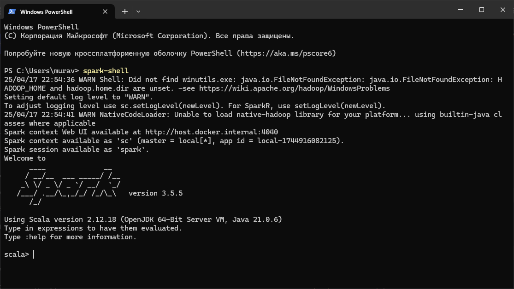
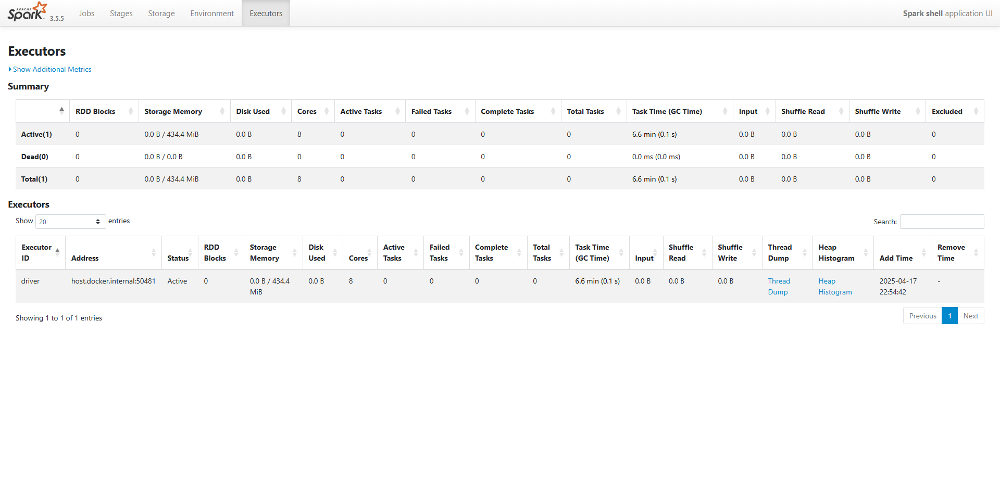
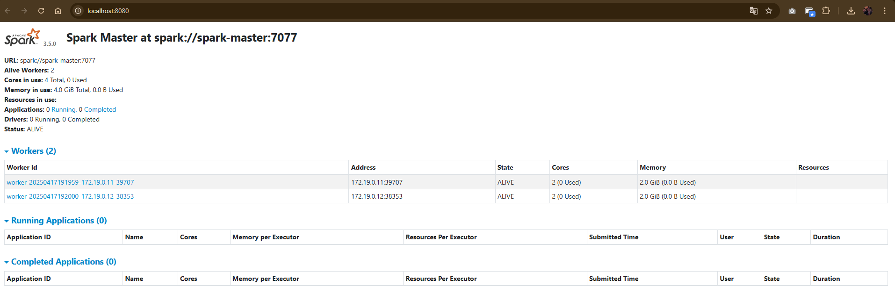
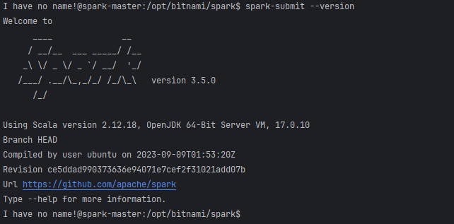

= Spark

1) Установите Spark локально на операционную систему.

2) Запустите интепретатор Scala/Python и выполнить простой код (например, подсчет количества слов в тексте)

[source,scala]
----
val text = "Hello world"

val wordCounts = text.split(" ")
  .groupBy(identity)
  .mapValues(_.length)

println(wordCounts)
----

3) При помощи встроенных средств выведите информацию о Spark в консоль

4) Выведите web-страницу с информацией о Spark и его текущей загрузке

5) Установите Spark на кластер Hadoop, созданный в предыдущей практической работе

6)	При помощи встроенных средств выведите информацию о Spark в консоль

[source,bash]
----
spark-submit --version
----

7) Выведите web-страницу с информцией о Spark и его текущей загрузке

8) Сконфигуруйте и подготовьте к работе Spark SQL

